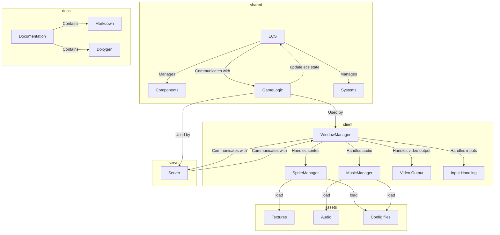

# Project Documentation

## Architecture

#### Diagram

#### Primary system and their roles

1. **WindowManager**: Manages the main game window, handles events, and updates the game state.
2. **SpriteManager**: Loads and manages sprites from the filesystem, handles sprite scaling and positioning.
3. **MusicManager**: Manages background music and sound effects, including volume control and muting.
4. **ECS (Entity-Component-System)**: Manages game entities and their components, handles game logic and updates.

### Code Materialization

#### Structure

- client/src: Contains the client-side code.
- server/src: Contains the server-side code.
- shared/src: Contains the shared code between the client and the server and the ECS.
- docs: Contains the project documentation.
- assets: Contains the project assets (images, sounds, etc.) and their configuration files.

### How-to

#### Add a new sprite

1. Add the sprite image to the assets folder.
2. Add the sprite configuration to the sprites_config.cfg file.

#### Handle events

1. Create an event entry in the `_eventsHandler` method in WindowManager.cpp
2. Add the event handling logic in the `_handleEvent` method in WindowManager.cpp

#### Add a new ECS Component

1. Create a new structure in the shared/ECS/ folder.

### Contribution Guidelines

#### Coding Style

- Use the clang-tidy tool to ensure code quality.
- Use meaningful variable and function names.
- Write clear and concise docstring comments when necessary.
- Create usage documentation for new features in the docs folder.

#### Pull Request Process

1. Create a new branch for your feature or bug fix, starting from `dev`.
2. Commit your changes and push your branch to the repository.
3. Squash your commits into a single commit before creating a pull request.
4. Create a pull request from your branch to the `dev` branch.
5. Wait for the code review and address any comments or feedback.

#### Naming Conventions

##### Branches

use the following naming convention for branches:

<triggram>/<branch-name>

example: `mra/feature-branch`

##### Commits

use the following naming convention for commits:

<type>(scope): <description>

example: `feat(client): add new feature`

types can be:

- feat: a new feature
- evol: an improvement or enhancement
- fix: a bug fix
- hotfix: a critical bug fix
- docs: documentation changes
- refact: code refactoring
- test: adding or updating tests
- ci: changes to CI/CD configuration
- wip: work in progress (for temporary commits)

#### CI/CD

The project uses GitHub Actions for continuous integration and deployment. The CI/CD pipeline runs on every push to the repository and checks the code quality, runs the tests, and builds the project.

- Check the compilation status.
- Create a release on the GitHub repository.

#### Linter and Formatter Usage

##### Tools

- clang-tidy: Used for static code analysis.
- clang-format: Used for code formatting.

##### Usage

- Run clang-tidy to analyze the code for potential issues.
- Run clang-format to format the code according to the project's style guidelines.

#### Branching strategy

- Use `master` for stable releases.
- Use `dev` for ongoing development.
- Create feature branches from `dev` for new features.
- Create hotfix branches from `master` for urgent fixes.
